```mermaid
classDiagram
    direction TB

    %% ===== DOMAIN MODELS =====

    class User {
        -id: string
        -email: string
        -passwordHash: string
        -username: string
        -role: UserRole
        -isActive: boolean
        -isVerified: boolean
        -createdAt: Date
        +activate(): void
        +deactivate(): void
        +changeRole(role: UserRole): void
    }

    class UserRole {
        <<enumeration>>
        ADMIN
        SELLER
        CUSTOMER
    }

    class SellerProfile {
        -id: string
        -userId: string
        -brandName: string
        -description: string
        -status: SellerStatus
        -createdAt: Date
        -reviewedAt: Date
        +approve(): void
        +reject(): void
    }

    class SellerStatus {
        <<enumeration>>
        PENDING
        APPROVED
        REJECTED
    }

    class Product {
        -id: string
        -sellerId: string
        -name: string
        -description: string
        -price: number
        -status: ProductStatus
        -createdAt: Date
        -updatedAt: Date
        +publish(): void
        +archive(): void
    }

    class ProductStatus {
        <<enumeration>>
        DRAFT
        UPCOMING
        LIVE
        SOLD_OUT
        ARCHIVED
    }

    class ProductImage {
        -id: string
        -productId: string
        -imageUrl: string
        -isPrimary: boolean
        +markPrimary(): void
    }

    class Drop {
        -id: string
        -productId: string
        -startTime: Date
        -endTime: Date
        -totalStock: number
        -remainingStock: number
        -status: DropStatus
        +start(): void
        +end(): void
        +reduceStock(qty: number): void
    }

    class DropStatus {
        <<enumeration>>
        UPCOMING
        LIVE
        ENDED
    }

    class Order {
        -id: string
        -userId: string
        -totalAmount: number
        -status: OrderStatus
        -createdAt: Date
        +confirm(): void
        +cancel(): void
    }

    class OrderStatus {
        <<enumeration>>
        PENDING
        CONFIRMED
        CANCELLED
    }

    class OrderItem {
        -id: string
        -orderId: string
        -productId: string
        -quantity: number
        -priceAtPurchase: number
    }

    class Review {
        -id: string
        -userId: string
        -productId: string
        -rating: number
        -comment: string
        -status: ReviewStatus
        -createdAt: Date
        +hide(): void
        +remove(): void
    }

    class ReviewStatus {
        <<enumeration>>
        VISIBLE
        HIDDEN
        REMOVED
    }

    class Notification {
        -id: string
        -userId: string
        -type: NotificationType
        -title: string
        -message: string
        -isRead: boolean
        -createdAt: Date
        +markAsRead(): void
    }

    class NotificationType {
        <<enumeration>>
        DROP_LIVE
        DROP_ENDING
        ORDER_UPDATE
        SYSTEM
    }

    class AuditLog {
        -id: string
        -userId: string
        -action: string
        -entityType: string
        -entityId: string
        -details: JSON
        -createdAt: Date
    }

    %% ===== SERVICE LAYER =====

    class UserService {
        -userRepo: IUserRepository
        +register(): User
        +activateUser(userId: string): void
        +deactivateUser(userId: string): void
    }

    class SellerService {
        -sellerRepo: ISellerRepository
        +submitSellerProfile(): SellerProfile
        +approveSeller(profileId: string): void
        +rejectSeller(profileId: string): void
    }

    class ProductService {
        -productRepo: IProductRepository
        +createProduct(): Product
        +publishProduct(productId: string): void
    }

    class DropService {
        -dropRepo: IDropRepository
        +scheduleDrop(): Drop
        +startDrop(dropId: string): void
        +endDrop(dropId: string): void
    }

    class OrderService {
        -orderRepo: IOrderRepository
        +createOrder(): Order
        +confirmOrder(orderId: string): void
        +cancelOrder(orderId: string): void
    }

    class NotificationService {
        -observers: INotificationObserver[]
        +notify(event: string): void
        +send(userId: string, notification: Notification): void
    }

    class INotificationObserver {
        <<interface>>
        +onEvent(event: string): void
    }

    %% ===== REPOSITORY INTERFACES =====

    class IUserRepository {
        <<interface>>
        +findById(id: string): User
        +findByEmail(email: string): User
        +save(user: User): User
    }

    class ISellerRepository {
        <<interface>>
        +findByUserId(userId: string): SellerProfile
        +save(profile: SellerProfile): SellerProfile
        +update(profile: SellerProfile): void
    }

    class IProductRepository {
        <<interface>>
        +findById(id: string): Product
        +save(product: Product): Product
        +update(product: Product): void
    }

    class IDropRepository {
        <<interface>>
        +findById(id: string): Drop
        +save(drop: Drop): Drop
        +update(drop: Drop): void
    }

    class IOrderRepository {
        <<interface>>
        +findById(id: string): Order
        +save(order: Order): Order
        +update(order: Order): void
    }

    %% ===== RELATIONSHIPS =====

    User --> UserRole
    User "1" --> "0..1" SellerProfile : has
    SellerProfile --> SellerStatus

    User "1" --> "*" Product : creates
    SellerProfile "1" --> "*" Product : owns
    Product --> ProductStatus
    Product "1" --> "*" ProductImage : has

    Product "1" --> "1" Drop : launched via
    Drop --> DropStatus

    User "1" --> "*" Order : places
    Order --> OrderStatus
    Order "1" --> "*" OrderItem : contains

    User "1" --> "*" Review : writes
    Review --> ReviewStatus

    User "1" --> "*" Notification : receives
    Notification --> NotificationType

    User "1" --> "*" AuditLog : generates

    UserService --> IUserRepository
    SellerService --> ISellerRepository
    ProductService --> IProductRepository
    DropService --> IDropRepository
    OrderService --> IOrderRepository
    NotificationService --> INotificationObserver
```

# Class Diagram — DropVault

## Overview

This class diagram represents the major domain models, services, and architectural layers of the **DropVault** platform.  
The design follows **Clean Architecture principles** with clear separation between **Controllers, Services, and Repositories**, and applies core **Object-Oriented Programming (OOP)** concepts and **design patterns**.

---

---
## Design Patterns in the Class Diagram
| Pattern           | Where Applied                                  | Purpose                                   |
| ----------------- | ---------------------------------------------- | ----------------------------------------- |
| **Repository**    | `IUserRepository`, `IProductRepository`, etc.  | Decouples data access from business logic |
| **Observer**      | `NotificationService`, `INotificationObserver` | Event-driven notifications                |
| **State**         | `ProductStatus`, `DropStatus`, `OrderStatus`   | Manage lifecycle transitions              |
| **Service Layer** | `UserService`, `OrderService`, etc.            | Centralize business logic                 |
| **Facade**        | Services                                       | Simplified access to complex operations   |

---
## OOP Principles Applied
| Principle         | Application                                          |
| ----------------- | ---------------------------------------------------- |
| **Encapsulation** | Domain models expose behavior via methods            |
| **Abstraction**   | Repository interfaces hide persistence details       |
| **Inheritance**   | Enum-driven role behavior instead of class explosion |
| **Polymorphism**  | Notification observers handle different events       |
