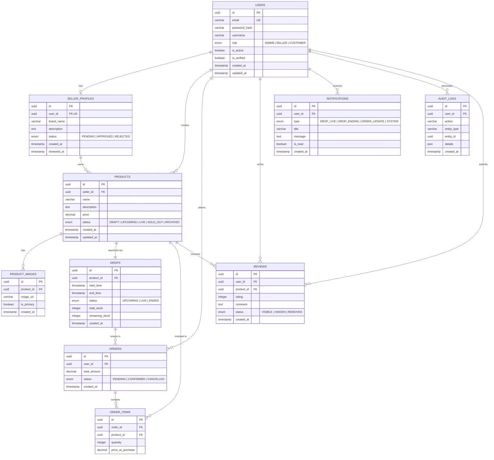

# ER Diagram — DropVault

## Overview

This Entity-Relationship diagram represents the database schema for **DropVault**, a drop-based e-commerce platform designed for sneaker and streetwear releases.  
All entities, attributes, data types, and relationships are defined to model real-world marketplace workflows such as role-based access control, seller onboarding, drop scheduling, and real-time commerce behavior.

---

---

## Table Summary
| Table             | Description                                  | Key Relationships                  |
| ----------------- | -------------------------------------------- | ---------------------------------- |
| `USERS`           | All platform users (admin, seller, customer) | → Seller Profile, Products, Orders |
| `SELLER_PROFILES` | Seller onboarding and approval details       | ← User (1:1), → Products           |
| `PRODUCTS`        | Items listed for drops                       | ← Seller, → Drop, Images           |
| `PRODUCT_IMAGES`  | Images associated with products              | ← Product                          |
| `DROPS`           | Time-bound product release window            | ← Product                          |
| `ORDERS`          | Customer purchase records                    | ← User, → Order Items              |
| `ORDER_ITEMS`     | Junction table for products within orders    | ← Order, Product                   |
| `REVIEWS`         | Customer feedback on products                | ← User, Product                    |
| `NOTIFICATIONS`   | System and user-triggered notifications      | ← User                             |
| `AUDIT_LOGS`      | Action logs for system transparency          | ← User                             |

---
## Key Indexes
| Table             | Index                      | Purpose                         |
| ----------------- | -------------------------- | ------------------------------- |
| `USERS`           | `(email)`                  | Fast authentication lookup      |
| `SELLER_PROFILES` | `(status)`                 | Pending seller approval queries |
| `PRODUCTS`        | `(seller_id, status)`      | Seller product management       |
| `DROPS`           | `(status, start_time)`     | Fetch upcoming and live drops   |
| `ORDERS`          | `(user_id, status)`        | User order history              |
| `ORDER_ITEMS`     | `(order_id)`               | Order composition lookup        |
| `REVIEWS`         | `(product_id, status)`     | Moderated review display        |
| `NOTIFICATIONS`   | `(user_id, is_read)`       | Unread notifications            |
| `AUDIT_LOGS`      | `(entity_type, entity_id)` | Entity audit trail              |
