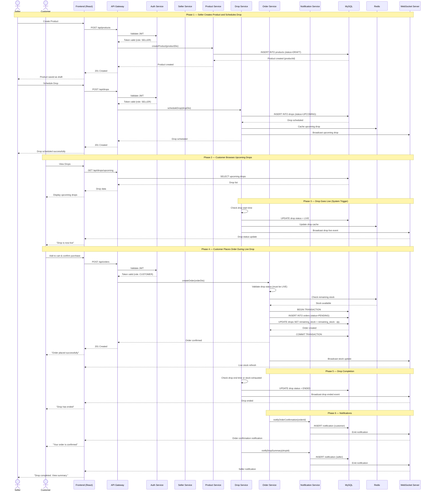

# Sequence Diagram — DropVault

## Main Flow: End-to-End Drop Purchase (Seller Creates Drop → Customer Purchases → Order Confirmation)

This sequence diagram illustrates the complete lifecycle of a **drop-based purchase** on the DropVault platform — from a seller scheduling a product drop, to a customer purchasing during a live drop, through to order confirmation and notifications.

---

---
## Flow Summary
| Phase                          | Description                                                                             | Key Patterns Used   |
| ------------------------------ | --------------------------------------------------------------------------------------- | ------------------- |
| **1. Product & Drop Creation** | Seller creates product and schedules a drop after authentication and role validation.   | RBAC, Service Layer |
| **2. Drop Discovery**          | Customers browse upcoming drops retrieved from cache and database.                      | Cache-Aside Pattern |
| **3. Drop Activation**         | System automatically activates drop at scheduled time and broadcasts updates.           | Scheduler, Observer |
| **4. Live Purchase**           | Customer places order during live drop with stock validation and transactional updates. | Transaction Script  |
| **5. Drop Completion**         | Drop ends due to time expiry or stock exhaustion.                                       | State Pattern       |
| **6. Notifications**           | Customers and sellers receive real-time notifications and updates.                      | Observer Pattern    |
