```mermaid
graph TB
    subgraph DropVault Platform
        UC1["Register / Login"]
        UC2["Manage Profile"]
        UC3["Browse Products"]
        UC4["View Upcoming Drops"]
        UC5["View Live Drops"]
        UC6["Add to Cart"]
        UC7["Place Order"]
        UC8["View Order History"]
        UC9["Write Review"]
        UC10["Report Review"]
        UC11["Create Product"]
        UC12["Schedule Drop"]
        UC13["Manage Inventory"]
        UC14["View Drop Analytics"]
        UC15["Fulfill Orders"]
        UC16["Request Seller Approval"]
        UC17["Approve / Reject Seller"]
        UC18["Moderate Products"]
        UC19["Moderate Reviews"]
        UC20["Manage Users"]
        UC21["Monitor Platform Activity"]
        UC22["Configure Platform Settings"]
        UC23["View Audit Logs"]
        UC24["Auto-Publish Drop"]
        UC25["Lock Inventory"]
        UC26["Release Inventory"]
        UC27["Send Notifications"]
        UC28["Real-Time Stock Updates"]
    end

    Customer((Customer))
    Seller((Seller))
    Admin((Admin))

    %% Customer use cases
    Customer --> UC1
    Customer --> UC2
    Customer --> UC3
    Customer --> UC4
    Customer --> UC5
    Customer --> UC6
    Customer --> UC7
    Customer --> UC8
    Customer --> UC9
    Customer --> UC10

    %% Seller use cases
    Seller --> UC1
    Seller --> UC2
    Seller --> UC11
    Seller --> UC12
    Seller --> UC13
    Seller --> UC14
    Seller --> UC15
    Seller --> UC16

    %% Admin use cases
    Admin --> UC1
    Admin --> UC17
    Admin --> UC18
    Admin --> UC19
    Admin --> UC20
    Admin --> UC21
    Admin --> UC22
    Admin --> UC23

    %% System-driven use cases
    UC12 -.->|scheduled time| UC24
    UC7 -.->|triggers| UC25
    UC7 -.->|on failure| UC26
    UC24 -.->|triggers| UC27
    UC25 -.->|triggers| UC28
```

# Use Case Diagram — DropVault

## Overview

This diagram shows all major use cases for the DropVault platform, organized by the three primary actors: **Customer**, **Seller**, and **Admin**.  
The system focuses on **drop-based commerce**, **real-time inventory**, **RBAC**, and **platform governance**.

---

---
## Use Case Descriptions
| #    | Use Case                    | Actors           | Description                                                            |
| ---- | --------------------------- | ---------------- | ---------------------------------------------------------------------- |
| UC1  | Register / Login            | All              | Authenticate users using JWT-based authentication and role assignment. |
| UC2  | Manage Profile              | Customer, Seller | Update personal information, addresses, and account settings.          |
| UC3  | Browse Products             | Customer         | View all available products including archived and non-drop listings.  |
| UC4  | View Upcoming Drops         | Customer         | See scheduled upcoming drops with countdown timers.                    |
| UC5  | View Live Drops             | Customer         | Participate in active drops with limited inventory.                    |
| UC6  | Add to Cart                 | Customer         | Add product to cart during a live drop.                                |
| UC7  | Place Order                 | Customer         | Place an order with transactional inventory locking.                   |
| UC8  | View Order History          | Customer         | View past and current orders with statuses.                            |
| UC9  | Write Review                | Customer         | Submit a review after a completed purchase.                            |
| UC10 | Report Review               | Customer         | Report inappropriate or misleading reviews.                            |
| UC11 | Create Product              | Seller           | Create new product listings (initially in DRAFT state).                |
| UC12 | Schedule Drop               | Seller           | Schedule a product drop with start/end time and stock quantity.        |
| UC13 | Manage Inventory            | Seller           | Update stock levels and product availability.                          |
| UC14 | View Drop Analytics         | Seller           | View performance metrics for completed drops.                          |
| UC15 | Fulfill Orders              | Seller           | Process and mark orders as shipped/fulfilled.                          |
| UC16 | Request Seller Approval     | Seller           | Apply for seller verification to publish products.                     |
| UC17 | Approve / Reject Seller     | Admin            | Approve or reject seller onboarding requests.                          |
| UC18 | Moderate Products           | Admin            | Approve, hide, or remove product listings.                             |
| UC19 | Moderate Reviews            | Admin            | Review, approve, or remove reported reviews.                           |
| UC20 | Manage Users                | Admin            | Activate, deactivate, or manage user roles.                            |
| UC21 | Monitor Platform Activity   | Admin            | Monitor system health, traffic, and ongoing drops.                     |
| UC22 | Configure Platform Settings | Admin            | Configure system-wide settings like fees and limits.                   |
| UC23 | View Audit Logs             | Admin            | View audit trail of critical system actions.                           |
| UC24 | Auto-Publish Drop           | System           | Automatically publish a drop at its scheduled start time.              |
| UC25 | Lock Inventory              | System           | Temporarily reserve inventory during checkout.                         |
| UC26 | Release Inventory           | System           | Release reserved inventory if checkout fails or expires.               |
| UC27 | Send Notifications          | System           | Notify users about drop status, orders, and moderation events.         |
| UC28 | Real-Time Stock Updates     | System           | Push real-time stock updates to connected clients via WebSockets.      |
